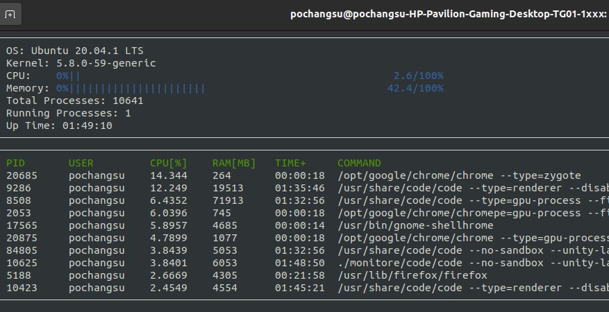

# CppND-System-Monitor

## ncurses

[ncurses](https://www.gnu.org/software/ncurses/) is a library that facilitates text-based graphical output in the terminal. This project relies on ncurses for display output. 

Install ncurses within your own Linux environment: `sudo apt install libncurses5-dev libncursesw5-dev`

## Make
This project uses [Make](https://www.gnu.org/software/make/). The Makefile has four targets:
* `build` compiles the source code and generates an executable
* `format` applies [ClangFormat](https://clang.llvm.org/docs/ClangFormat.html) to style the source code
* `debug` compiles the source code and generates an executable, including debugging symbols
* `clean` deletes the `build/` directory, including all of the build artifacts

## Instructions

1. Clone the project repository: `git clone https://github.com/PoChang007/C_Plus_Plus_Nanodegree.git`

2. `cd C_Plus_Plus_Nanodegree/Project_2_System_Monitor`

3. `mkdir build && cd build`

4.  `cmake .. && make -j4`

5. Run the resulting executable: `./monitor`
