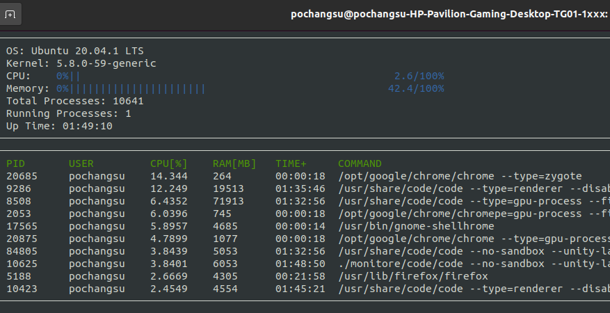

# Udacity - C++ Nanodegree Program

The summary of my learnings in Udacity's CPPND program.  
The program first walks you through Object-Oriented Programming concepts and then gets you exposed to Modern C++ features.

## Installation

Clone this repo: `git clone https://github.com/PoChang007/C_Plus_Plus_Nanodegree.git`

Each project can be built individually. See the instruction in each project folder.

## Project 1 - Route Planning

In this project, we create a route planner between two points on real map data. The optimal path between the starting point and the ending point can be found by implementing A* search algorithm.

## Project 2 - System Monitor

In this project, we build a system monitor that resemble the program [htop](https://htop.dev/), which is a standard program for monitoring Linux systems.

## Project 3 - Memory Management Chatbot

In this project, we optimize a Chatbot program with modern c++ memory management method (e.g. smart pointer, move semantics).

## Project 4 - Program a Concurrent Traffic Simulation

In this project, we build a multithreaded traffic simulator (vehicles, streets, intersections and traffic lights) using a real urban map. Each vehicle is run on a separate thread. And intersections are managed to facilitate traffic flow and avoid collisions.

